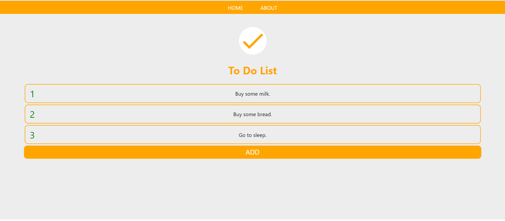

<h1>To Do App</h1>

<a href="https://yordankrushkov.github.io/todo-web/"><h2>View the app</h2></a>

<h4>Description</h4>
 A single page application. 
<h4>Technologies</h4>
React.JS

<h4>Server</h4>
Node.JS, Express, Mongo DB, Mongoose.

<a href="https://github.com/YordanKrushkov/todo-server">Back End</a>

<h4>Installation</h4>
1. Fork/clone/download the repo and run npm install inside the folder.  
2. Run npm start.  
  

<h4>Screenshots</h4>

